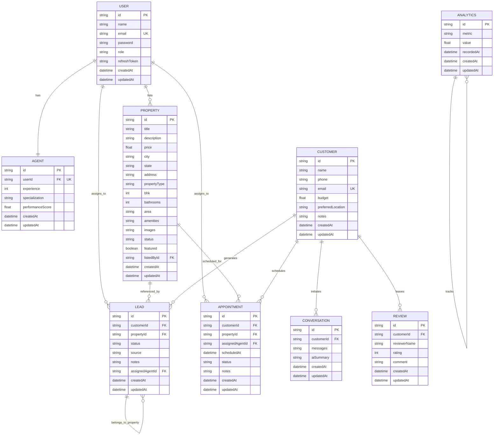
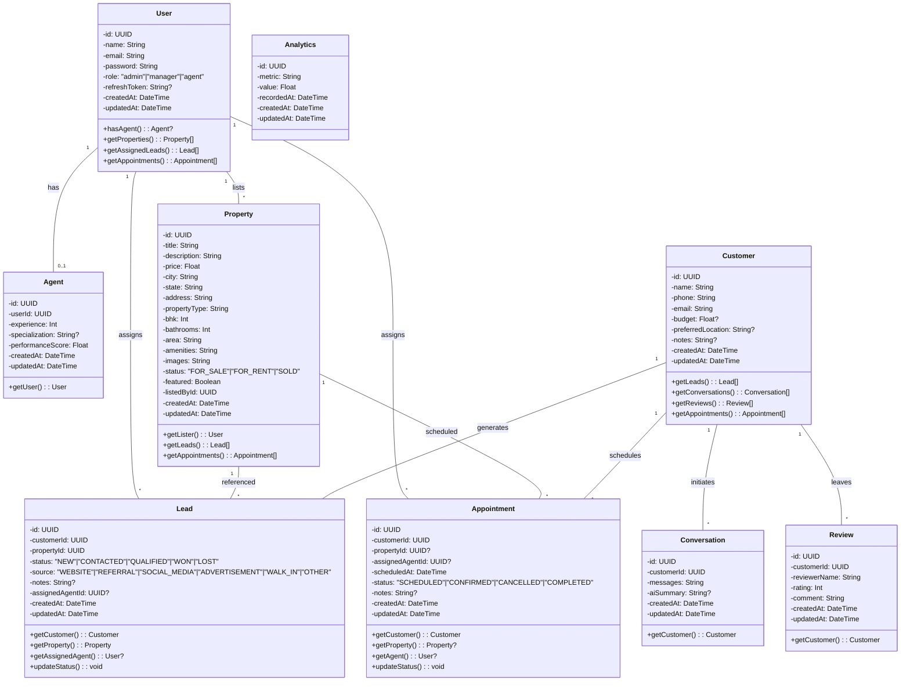

# Yandox CRM - Database Schema Analysis

**Analysis Date:** May 26, 2026  
**Database:** SQLite via Prisma ORM  
**Codebase:** Property Frontend Repository (backend-phase branch)

---

## 1. ENTITY DEFINITIONS

### 1.1 User Model
**Purpose:** Core authentication and user management for system access  
**Primary Key:** `id` (UUID)

| Field | Type | Nullable | Constraints | Default | Description |
|-------|------|----------|-------------|---------|-------------|
| id | String (UUID) | No | PK, @id | uuid() | Unique user identifier |
| name | String | No | - | - | User's full name |
| email | String | No | @unique | - | Email address (unique per user) |
| password | String | No | - | - | Hashed password |
| role | String | No | - | "agent" | User role (admin \| manager \| agent) |
| refreshToken | String | Yes | - | null | JWT refresh token for auth |
| createdAt | DateTime | No | - | now() | Record creation timestamp |
| updatedAt | DateTime | No | @updatedAt | - | Last modified timestamp |

**Relations:**
- **One-to-One:** User ↔ Agent (via `Agent.userId`) - ONE User can have ONE Agent profile
- **One-to-Many:** User → Property (via `Property.listedById`) - ONE User lists MANY Properties
- **One-to-Many:** User → Lead (via `Lead.assignedAgentId`, relation "AgentLeads") - ONE User assigned to MANY Leads
- **One-to-Many:** User → Appointment (via `Appointment.assignedAgentId`) - ONE User has MANY Appointments

**Indexes:**
- email (unique, indexed for login)

**Cascade Rules:**
- Agent profile cascades on delete (Agent.onDelete: Cascade)

---

### 1.2 Agent Model
**Purpose:** Agent-specific profile extending User with expertise data  
**Primary Key:** `id` (UUID)

| Field | Type | Nullable | Constraints | Default | Description |
|-------|------|----------|-------------|---------|-------------|
| id | String (UUID) | No | PK, @id | uuid() | Unique agent identifier |
| userId | String (UUID) | No | FK, @unique | - | References User.id (one-to-one) |
| experience | Int | No | - | 0 | Years of experience |
| specialization | String | Yes | - | null | Area of specialization (e.g., "Residential Sales") |
| performanceScore | Float | No | - | 0 | Agent performance rating (0-100) |
| createdAt | DateTime | No | - | now() | Record creation timestamp |
| updatedAt | DateTime | No | @updatedAt | - | Last modified timestamp |

**Relations:**
- **One-to-One:** Agent → User (via `userId`) - REQUIRED User reference (Cascade delete)

**Indexes:**
- userId (unique, enforces 1:1 relationship)

**Cascade Rules:**
- Deleting User cascades to delete Agent (onDelete: Cascade)

---

### 1.3 Property Model
**Purpose:** Real estate property listings  
**Primary Key:** `id` (UUID)

| Field | Type | Nullable | Constraints | Default | Description |
|-------|------|----------|-------------|---------|-------------|
| id | String (UUID) | No | PK, @id | uuid() | Unique property identifier |
| title | String | No | - | - | Property title/name |
| description | String | No | - | - | Detailed property description |
| price | Float | No | - | - | Property price in base currency |
| city | String | No | - | - | City location |
| state | String | No | - | - | State/province location |
| address | String | No | - | - | Full street address |
| propertyType | String | No | - | - | Type of property (e.g., "Apartment", "Villa", "Townhouse") |
| bhk | Int | No | - | - | Number of bedrooms |
| bathrooms | Int | No | - | - | Number of bathrooms |
| area | String | No | - | - | Property area/size |
| amenities | String | No | - | - | Amenities list (JSON-formatted) |
| images | String | No | - | - | Image URLs (JSON-formatted array) |
| status | String | No | - | - | Status: FOR_SALE \| FOR_RENT \| SOLD |
| featured | Boolean | No | - | false | Featured listing flag |
| listedById | String (UUID) | No | FK | - | References User.id (listing agent) |
| createdAt | DateTime | No | - | now() | Record creation timestamp |
| updatedAt | DateTime | No | @updatedAt | - | Last modified timestamp |

**Relations:**
- **Many-to-One:** Property → User (via `listedById`) - MANY Properties listed by ONE User (Cascade delete)
- **One-to-Many:** Property → Lead (implicit via Lead.propertyId) - ONE Property has MANY Leads
- **One-to-Many:** Property → Appointment (via `Appointment.propertyId`) - ONE Property has MANY Appointments

**Indexes:**
- (city, state) - composite index for location-based queries
- (propertyType, status) - composite index for filtering

**Cascade Rules:**
- Deleting User (lister) cascades to delete all their Properties (onDelete: Cascade)

---

### 1.4 Customer Model
**Purpose:** Customer/prospect profiles in the CRM  
**Primary Key:** `id` (UUID)

| Field | Type | Nullable | Constraints | Default | Description |
|-------|------|----------|-------------|---------|-------------|
| id | String (UUID) | No | PK, @id | uuid() | Unique customer identifier |
| name | String | No | - | - | Customer's full name |
| phone | String | No | - | - | Contact phone number |
| email | String | No | @unique | - | Email address (unique per customer) |
| budget | Float | Yes | - | null | Budget in base currency (optional) |
| preferredLocation | String | Yes | - | null | Preferred location for properties |
| notes | String | Yes | - | null | Internal notes about customer |
| createdAt | DateTime | No | - | now() | Record creation timestamp |
| updatedAt | DateTime | No | @updatedAt | - | Last modified timestamp |

**Relations:**
- **One-to-Many:** Customer → Lead (via `Lead.customerId`) - ONE Customer has MANY Leads
- **One-to-Many:** Customer → Conversation (via `Conversation.customerId`) - ONE Customer has MANY Conversations
- **One-to-Many:** Customer → Review (via `Review.customerId`) - ONE Customer can leave MANY Reviews
- **One-to-Many:** Customer → Appointment (via `Appointment.customerId`) - ONE Customer has MANY Appointments

**Indexes:**
- email (unique)
- phone

**Cascade Rules:**
- Deleting Customer cascades to delete all related Leads, Conversations, Reviews, and Appointments (onDelete: Cascade)

---

### 1.5 Lead Model
**Purpose:** Sales leads tracking customer property interest  
**Primary Key:** `id` (UUID)

| Field | Type | Nullable | Constraints | Default | Description |
|-------|------|----------|-------------|---------|-------------|
| id | String (UUID) | No | PK, @id | uuid() | Unique lead identifier |
| customerId | String (UUID) | No | FK | - | References Customer.id (Cascade delete) |
| propertyId | String (UUID) | No | FK | - | References Property.id (Cascade delete) |
| status | String | No | - | "NEW" | Status: NEW \| CONTACTED \| QUALIFIED \| WON \| LOST |
| source | String | No | - | - | Lead source: WEBSITE \| REFERRAL \| SOCIAL_MEDIA \| ADVERTISEMENT \| WALK_IN \| OTHER |
| notes | String | Yes | - | null | Internal notes about lead |
| assignedAgentId | String (UUID) | Yes | FK | null | References User.id (SetNull on delete) |
| createdAt | DateTime | No | - | now() | Record creation timestamp |
| updatedAt | DateTime | No | @updatedAt | - | Last modified timestamp |

**Relations:**
- **Many-to-One:** Lead → Customer (via `customerId`) - REQUIRED, MANY Leads per Customer (Cascade delete)
- **Many-to-One:** Lead → Property (via `propertyId`) - REQUIRED, MANY Leads per Property (Cascade delete)
- **Many-to-One:** Lead → User (via `assignedAgentId`, relation "AgentLeads") - OPTIONAL, MANY Leads per User (SetNull on delete)

**Indexes:**
- customerId
- propertyId
- assignedAgentId

**Cascade Rules:**
- Deleting Customer deletes all Leads (Cascade)
- Deleting Property deletes all Leads (Cascade)
- Deleting User (Agent) sets assignedAgentId to NULL (SetNull) - Lead becomes unassigned

---

### 1.6 Conversation Model
**Purpose:** Stores customer conversations/communications  
**Primary Key:** `id` (UUID)

| Field | Type | Nullable | Constraints | Default | Description |
|-------|------|----------|-------------|---------|-------------|
| id | String (UUID) | No | PK, @id | uuid() | Unique conversation identifier |
| customerId | String (UUID) | No | FK | - | References Customer.id (Cascade delete) |
| messages | String | No | - | - | Conversation messages (JSON-formatted) |
| aiSummary | String | Yes | - | null | AI-generated conversation summary |
| createdAt | DateTime | No | - | now() | Record creation timestamp |
| updatedAt | DateTime | No | @updatedAt | - | Last modified timestamp |

**Relations:**
- **Many-to-One:** Conversation → Customer (via `customerId`) - REQUIRED, MANY Conversations per Customer (Cascade delete)

**Indexes:**
- customerId

**Cascade Rules:**
- Deleting Customer deletes all Conversations (Cascade)

---

### 1.7 Review Model
**Purpose:** Customer reviews and ratings  
**Primary Key:** `id` (UUID)

| Field | Type | Nullable | Constraints | Default | Description |
|-------|------|----------|-------------|---------|-------------|
| id | String (UUID) | No | PK, @id | uuid() | Unique review identifier |
| customerId | String (UUID) | No | FK | - | References Customer.id (Cascade delete) |
| reviewerName | String | No | - | - | Name of review author |
| rating | Int | No | - | - | Rating value (typically 1-5 stars) |
| comment | String | No | - | - | Review comment/text |
| createdAt | DateTime | No | - | now() | Record creation timestamp |
| updatedAt | DateTime | No | @updatedAt | - | Last modified timestamp |

**Relations:**
- **Many-to-One:** Review → Customer (via `customerId`) - REQUIRED, MANY Reviews per Customer (Cascade delete)

**Indexes:**
- customerId

**Cascade Rules:**
- Deleting Customer deletes all Reviews (Cascade)

---

### 1.8 Appointment Model
**Purpose:** Scheduled customer appointments/showings  
**Primary Key:** `id` (UUID)

| Field | Type | Nullable | Constraints | Default | Description |
|-------|------|----------|-------------|---------|-------------|
| id | String (UUID) | No | PK, @id | uuid() | Unique appointment identifier |
| customerId | String (UUID) | No | FK | - | References Customer.id (Cascade delete) |
| propertyId | String (UUID) | Yes | FK | null | References Property.id (SetNull on delete) |
| assignedAgentId | String (UUID) | Yes | FK | null | References User.id (SetNull on delete) |
| scheduledAt | DateTime | No | - | - | Appointment date and time |
| status | String | No | - | "SCHEDULED" | Status: SCHEDULED \| CONFIRMED \| CANCELLED \| COMPLETED |
| notes | String | Yes | - | null | Appointment notes |
| createdAt | DateTime | No | - | now() | Record creation timestamp |
| updatedAt | DateTime | No | @updatedAt | - | Last modified timestamp |

**Relations:**
- **Many-to-One:** Appointment → Customer (via `customerId`) - REQUIRED, MANY Appointments per Customer (Cascade delete)
- **Many-to-One:** Appointment → Property (via `propertyId`) - OPTIONAL, MANY Appointments per Property (SetNull on delete)
- **Many-to-One:** Appointment → User (via `assignedAgentId`) - OPTIONAL, MANY Appointments per User (SetNull on delete)

**Indexes:**
- customerId
- assignedAgentId

**Cascade Rules:**
- Deleting Customer deletes all Appointments (Cascade)
- Deleting Property sets propertyId to NULL (SetNull) - Appointment remains but property unlinked
- Deleting User (Agent) sets assignedAgentId to NULL (SetNull) - Appointment becomes unassigned

---

### 1.9 Analytics Model
**Purpose:** System metrics and analytics tracking  
**Primary Key:** `id` (UUID)

| Field | Type | Nullable | Constraints | Default | Description |
|-------|------|----------|-------------|---------|-------------|
| id | String (UUID) | No | PK, @id | uuid() | Unique analytics record identifier |
| metric | String | No | - | - | Metric name/type |
| value | Float | No | - | - | Metric value |
| recordedAt | DateTime | No | - | now() | When metric was recorded |
| createdAt | DateTime | No | - | now() | Record creation timestamp |
| updatedAt | DateTime | No | @updatedAt | - | Last modified timestamp |

**Relations:**
- None - independent model

**Indexes:**
- metric

---

## 2. ENUMERATION VALUES

### User Roles
```
UserRole = "admin" | "manager" | "agent"
```

### Lead Status
```
LeadStatus = "NEW" | "CONTACTED" | "QUALIFIED" | "LOST" | "WON"
```

### Lead Source
```
LeadSource = "WEBSITE" | "REFERRAL" | "SOCIAL_MEDIA" | "ADVERTISEMENT" | "WALK_IN" | "OTHER"
```

### Property Status
```
PropertyStatus = "FOR_SALE" | "FOR_RENT" | "SOLD"
```

### Appointment Status
```
AppointmentStatus = "SCHEDULED" | "CONFIRMED" | "CANCELLED" | "COMPLETED"
```

---

## 3. RELATIONSHIP SUMMARY TABLE

| From | To | Cardinality | Relation Type | Cascade | Nullable | Description |
|------|----|----|---|---|---|
| User | Agent | 1:1 | HasOne | Delete → Delete | No | Agent profile per user |
| User | Property | 1:N | HasMany | Delete → Delete | No | User lists many properties |
| User | Lead | 1:N | HasMany (AgentLeads) | Delete → SetNull | Yes | User assigned to many leads |
| User | Appointment | 1:N | HasMany | Delete → SetNull | Yes | User assigned to many appointments |
| Agent | User | 1:1 | BelongsTo | - | No | Agent belongs to one user |
| Property | User | N:1 | BelongsTo | - | No | Property listed by one user |
| Property | Lead | 1:N | HasMany | Delete → Delete | No | Property has many leads |
| Property | Appointment | 1:N | HasMany | Delete → SetNull | Yes | Property has many appointments |
| Customer | Lead | 1:N | HasMany | Delete → Delete | No | Customer has many leads |
| Customer | Conversation | 1:N | HasMany | Delete → Delete | No | Customer has many conversations |
| Customer | Review | 1:N | HasMany | Delete → Delete | No | Customer has many reviews |
| Customer | Appointment | 1:N | HasMany | Delete → Delete | No | Customer has many appointments |
| Lead | Customer | N:1 | BelongsTo | - | No | Lead belongs to one customer |
| Lead | Property | N:1 | BelongsTo | - | No | Lead belongs to one property |
| Lead | User | N:1 | BelongsTo | - | Yes | Lead assigned to one user (optional) |
| Conversation | Customer | N:1 | BelongsTo | - | No | Conversation belongs to one customer |
| Review | Customer | N:1 | BelongsTo | - | No | Review belongs to one customer |
| Appointment | Customer | N:1 | BelongsTo | - | No | Appointment belongs to one customer |
| Appointment | Property | N:1 | BelongsTo | - | Yes | Appointment for one property (optional) |
| Appointment | User | N:1 | BelongsTo | - | Yes | Appointment assigned to one user (optional) |

---

## 4. MERMAID ER DIAGRAM



---

## 5. MERMAID CLASS DIAGRAM



---

## 6. ENTITY LIFECYCLE FLOW

### User Creation Flow
```
1. User Registration/Login
   ├─ Create User record (role = "agent" by default)
   ├─ Hash password
   ├─ Store refreshToken when authenticated
   └─ [Optional] Create Agent profile for agent-role users

2. User Authentication
   ├─ User logs in (email + password)
   ├─ Generate accessToken (15 min expiry)
   ├─ Generate refreshToken (7 days expiry)
   ├─ Store refreshToken in User.refreshToken
   └─ Return tokens to client

3. User Deletion
   ├─ Delete User record
   ├─ CASCADE: Delete Agent profile (if exists)
   ├─ CASCADE: Delete all Properties listed by this User
   ├─ SET NULL: Unassign all Leads assigned to this User
   └─ SET NULL: Unassign all Appointments assigned to this User
```

### Property Listing Flow
```
1. Create Property
   ├─ Create Property record
   ├─ Set listedById = current User.id
   ├─ Set status = "FOR_SALE" or "FOR_RENT"
   └─ Associate with user profile

2. Property Status Changes
   ├─ Update status to "SOLD" / "FOR_RENT" / "FOR_SALE"
   └─ Related Leads retain their association

3. Delete Property
   ├─ Delete Property record
   ├─ CASCADE: Delete all Leads referencing this property
   └─ SET NULL: Unlink all Appointments for this property
```

### Lead Generation Flow
```
1. Create Lead
   ├─ Customer interested in property
   ├─ Create Lead record (customerId, propertyId)
   ├─ Set status = "NEW"
   ├─ Set source (WEBSITE, REFERRAL, etc.)
   ├─ Optional: Assign to User (assignedAgentId)
   └─ Trigger notification to assigned agent

2. Lead Status Progression
   ├─ NEW → CONTACTED (agent reached out)
   ├─ CONTACTED → QUALIFIED (customer showed interest)
   ├─ QUALIFIED → WON (deal closed)
   └─ QUALIFIED → LOST (deal didn't work out)

3. Delete Lead
   ├─ Delete Lead record
   └─ No cascade effects
```

### Customer Management Flow
```
1. Create Customer
   ├─ Create Customer record
   ├─ Set name, phone, email
   ├─ Optional: Set budget, preferredLocation
   └─ Enable lead/appointment tracking

2. Customer Interactions
   ├─ Generate Lead (property interest)
   ├─ Schedule Appointment (property viewing)
   ├─ Store Conversation (communication history)
   └─ Leave Review (feedback)

3. Delete Customer
   ├─ Delete Customer record
   ├─ CASCADE: Delete all Leads for this customer
   ├─ CASCADE: Delete all Conversations for this customer
   ├─ CASCADE: Delete all Reviews from this customer
   └─ CASCADE: Delete all Appointments for this customer
```

### Appointment Flow
```
1. Create Appointment
   ├─ Create Appointment record
   ├─ Link to Customer (customerId) - REQUIRED
   ├─ Optional: Link to Property (propertyId)
   ├─ Optional: Assign to Agent (assignedAgentId)
   ├─ Set scheduledAt (date/time)
   └─ Set status = "SCHEDULED"

2. Appointment Status Progression
   ├─ SCHEDULED → CONFIRMED (customer confirmed)
   ├─ SCHEDULED/CONFIRMED → COMPLETED (meeting happened)
   └─ Any → CANCELLED (canceled by customer/agent)

3. Delete Appointment
   ├─ Delete Appointment record
   └─ No cascade effects to other entities
```

---

## 7. IDENTIFIED ISSUES & RISKS

### 7.1 Critical Issues

#### Issue 1: Conversation.messages Field Design
**Severity:** HIGH  
**Problem:** The `messages` field stores entire conversation as JSON string instead of separate Message records
```prisma
messages String  // Should be Message[] with a Message model
```
**Risk:** 
- Cannot query individual messages
- Cannot filter conversations by content
- Cannot update single messages
- Cannot implement message read/unread status
- Difficult to implement pagination

**Recommendation:** Create a separate `Message` model:
```prisma
model Message {
  id        String   @id @default(uuid())
  conversationId String
  conversation   Conversation @relation(fields: [conversationId], references: [id], onDelete: Cascade)
  content   String
  sender    String   // "customer" or "agent"
  createdAt DateTime @default(now())
}
```

---

#### Issue 2: Property.amenities and Property.images As Strings
**Severity:** MEDIUM  
**Problem:** Arrays stored as JSON strings instead of separate records
```prisma
amenities String  // Should normalize to Amenity[] or relation
images    String  // Should normalize to PropertyImage[] or relation
```
**Risk:**
- Cannot filter properties by specific amenities
- Cannot track which amenities are most desired
- Cannot organize/manage images separately
- Schema validation happens in application, not database

**Recommendation:** Create separate models:
```prisma
model PropertyAmenity {
  id         String @id @default(uuid())
  propertyId String
  property   Property @relation(fields: [propertyId], references: [id], onDelete: Cascade)
  amenity    String
}

model PropertyImage {
  id         String @id @default(uuid())
  propertyId String
  property   Property @relation(fields: [propertyId], references: [id], onDelete: Cascade)
  imageUrl   String
  order      Int
}
```

---

#### Issue 3: User.role as String Enum
**Severity:** MEDIUM  
**Problem:** Role stored as string without database-level validation
```prisma
role String @default("agent")  // Should be enum
```
**Risk:**
- Invalid role values can be stored via direct DB manipulation
- No type safety at database level
- Must validate in application layer

**Recommendation:** Create Prisma enum:
```prisma
enum UserRole {
  admin
  manager
  agent
}

model User {
  ...
  role UserRole @default(agent)
  ...
}
```

---

#### Issue 4: Lead.status and Lead.source as Strings
**Severity:** MEDIUM  
**Problem:** Similar to User.role, enums stored as strings
```prisma
status String @default("NEW")  // Should be enum
source String                   // Should be enum
```
**Recommendation:** Create Prisma enums for all status/source fields.

---

#### Issue 5: Property.status as String
**Severity:** MEDIUM  
**Problem:** Property status stored as string instead of enum
**Recommendation:** Create enum for property status

---

#### Issue 6: Missing Appointment.propertyId Index
**Severity:** LOW  
**Problem:** `propertyId` in Appointment lacks index, could slow queries
**Recommendation:** Add index:
```prisma
@@index([propertyId])
```

---

### 7.2 Cascade Delete Risks

| From | To | Current Behavior | Risk |
|------|----|----|---|
| User | Agent | DELETE CASCADE | Agent profile deleted when user deleted ✓ |
| User | Property | DELETE CASCADE | All properties deleted when user deleted ⚠️ RISK: Historical data loss |
| User | Lead | SET NULL | Lead becomes unassigned ✓ |
| User | Appointment | SET NULL | Appointment becomes unassigned ✓ |
| Property | Lead | DELETE CASCADE | Lead deleted when property removed ⚠️ RISK: Sales history lost |
| Property | Appointment | SET NULL | Appointment unlinked ✓ |
| Customer | Lead | DELETE CASCADE | All leads deleted ⚠️ RISK: CRM history lost |
| Customer | Conversation | DELETE CASCADE | All messages deleted ⚠️ RISK: Communication history lost |
| Customer | Review | DELETE CASCADE | All reviews deleted ⚠️ RISK: Feedback lost |
| Customer | Appointment | DELETE CASCADE | All appointments deleted ⚠️ RISK: Schedule history lost |

**Recommendations:**
- Consider soft deletes (add `deletedAt` field) for audit trail
- Implement archival strategy before physical deletion
- Add database triggers to log deletions

---

### 7.3 Orphan Record Risks

| Scenario | Current Risk | Impact |
|----------|-----|--------|
| Lead with deleted Customer | CASCADE prevents this | ✓ Protected |
| Lead with deleted Property | CASCADE prevents this | ✓ Protected |
| Lead with deleted Agent | SET NULL → unassigned | ✓ Safe, lead remains |
| Appointment with deleted Customer | CASCADE prevents this | ✓ Protected |
| Appointment with deleted Property | SET NULL → unlinked | ✓ Safe |
| Appointment with deleted Agent | SET NULL → unassigned | ✓ Safe |
| Property with deleted Lister | CASCADE prevents this | ✓ Protected |

**No orphan record risks detected** - Cascade rules properly configured.

---

### 7.4 Missing Relations / Data Integrity Issues

| Issue | Current State | Should Be | Impact |
|-------|---|---|---|
| Message as part of Conversation | String JSON | Separate Message model | Cannot query messages individually |
| Property Amenities | String JSON | Separate Amenity relation | Cannot filter by amenities |
| Property Images | String JSON | Separate Image relation | Cannot manage images separately |
| User Role validation | String | Enum | Invalid roles could exist |
| Lead Status validation | String | Enum | Invalid statuses could exist |
| Lead Source validation | String | Enum | Invalid sources could exist |
| Property Status validation | String | Enum | Invalid statuses could exist |
| Appointment Status validation | String | Enum | Invalid statuses could exist |
| Agent Specialization | Free text | Should have options | Cannot aggregate by specialization |
| Property Type | Free text | Should have options | Cannot standardize property types |

---

### 7.5 Performance Optimization Opportunities

| Index | Current | Recommendation | Reason |
|-------|---------|---|---|
| Appointment.propertyId | Missing | Add index | Enable property-based appointment queries |
| Appointment.scheduledAt | Missing | Add index | Enable date-range queries |
| Lead.status | Missing | Add index | Enable status filtering |
| Review.rating | Missing | Add index | Enable rating-based queries |
| User.role | Missing | Add index | Enable role-based user queries |
| Property.featured | Missing | Add index | Enable featured property queries |

---

### 7.6 Audit Trail Gaps

**Missing Fields:**
- No `deletedAt` field for soft deletes
- No `createdBy` to track who created records (except User records)
- No `updatedBy` to track who last modified records
- No change history/audit logs

**Recommendation:**
Add audit tracking:
```prisma
model AuditLog {
  id        String   @id @default(uuid())
  entityType String  // User, Lead, Property, etc.
  entityId  String
  action    String   // CREATE, UPDATE, DELETE
  changes   String   // JSON of what changed
  userId    String?  // Who made the change
  createdAt DateTime @default(now())
}
```

---

## 8. SCHEMA STATISTICS

| Metric | Count |
|--------|-------|
| Total Models | 9 |
| Total Relations | 20 |
| One-to-One Relations | 1 |
| One-to-Many Relations | 15 |
| Many-to-One Relations | 4 |
| Cascade Deletes | 10 |
| Set Null Relations | 3 |
| Nullable Fields | 12 |
| Unique Constraints | 5 |
| Indexes | 8 |
| Enum Types (Implicit) | 5 |

---

## 9. RECOMMENDATIONS SUMMARY

### High Priority
1. ✗ Normalize Conversation.messages → Separate Message model
2. ✗ Add Prisma enums for all status/source/role fields
3. ✗ Implement audit trail (AuditLog model + timestamps)

### Medium Priority
4. ✗ Normalize Property.amenities → Separate Amenity relation
5. ✗ Normalize Property.images → Separate Image relation
6. ✗ Add missing database indexes (propertyId in Appointment, etc.)
7. ✗ Consider soft deletes for historical data preservation

### Low Priority
8. Add User.role index for role-based queries
9. Document maximum string lengths/field constraints
10. Add check constraints for integer fields (rating 1-5, rating ranges)

---

## 10. SCHEMA CHANGE SAFETY CHECKLIST

Before deploying schema changes:

- [ ] All CASCADE relationships verified and intentional
- [ ] Enum values finalized and immutable
- [ ] New relations have proper indexes
- [ ] Foreign key constraints enable cascading
- [ ] Nullable fields documented for application logic
- [ ] Audit trail implementation tested
- [ ] Soft delete strategy defined
- [ ] Data migration plan for existing data
- [ ] Backup taken before migrations
- [ ] Schema version tracked in migrations
- [ ] Documentation updated for API consumers

---

**Document Generated:** May 26, 2026  
**Codebase Version:** backend-phase branch  
**Status:** ✓ VERIFIED AGAINST ACTUAL SCHEMA
